[comment]: # (Introduce to Pact - a contract testing tool)

[comment]: # (THEME = white)
[comment]: # (CODE_THEME = base16/zenburn)

[comment]: # (controls: true)

Tien Vo | Developer | August 19, 2023

# Pact

[comment]: # (!!!)

## Questions

- Are there a better way to test a (micro)service that depend on other (micro)service?  <!-- .element: class="fragment" -->
    - Using service mock?  <!-- .element: class="fragment" -->
    - Call service directly in test?  <!-- .element: class="fragment" -->
- My service depend on other service. Now it's not working correctly.  <!-- .element: class="fragment" -->
    - Does it related to the other service?  <!-- .element: class="fragment" -->
    - What did it changed?  <!-- .element: class="fragment" -->
    - When did it happen?  <!-- .element: class="fragment" -->
    - Why didn't I know about this?  <!-- .element: class="fragment" -->

[comment]: # (!!! data-auto-animate)

## Questions

- Can I refactor this code?  <!-- .element: class="fragment" -->
    - Can I remove this field?  <!-- .element: class="fragment" -->
    - Can I rename this field?  <!-- .element: class="fragment" -->
- Can I deploy this service to staging/production?  <!-- .element: class="fragment" -->
    - Which services I need to deploy first before mine?  <!-- .element: class="fragment" -->

[comment]: # (!!! data-auto-animate)

## The answer I am looking for:

Pact 🎉

[comment]: # (!!!)

## What is Pact?

- Code-first  <!-- .element: class="fragment" -->
- Consumer-driven  <!-- .element: class="fragment" -->
- Contract  <!-- .element: class="fragment" -->
- Testing tool  <!-- .element: class="fragment" -->

[comment]: # (!!! data-auto-animate)

## Code-first vs Design-first

- Code-first: contract is generated from (contract test) code  <!-- .element: class="fragment" -->
- Design-first: contract is generated from api design  <!-- .element: class="fragment" -->

[comment]: # (!!! data-auto-animate)

## Consumer-driven vs Provider-driven

- Consumer-driven: consumer write contract, provider test implementation against it  <!-- .element: class="fragment" -->
- Provider-driven: provider write contract, consumer test implementation against it  <!-- .element: class="fragment" -->

[comment]: # (!!! data-auto-animate)

## Code-first + Consumer-driven


[comment]: # (!!!)

## Design-first


[comment]: # (Image source: https://medium.com/coderbyte/design-first-contract-testing-for-micro-services-baf929e29f6c)

[comment]: # (!!!)

## Schema


[comment]: # (!!!)

## Contract


[comment]: # (!!!)

## Schema vs Contract

- Schema: Abstract  <!-- .element: class="fragment" -->
- Contract: Concrete  <!-- .element: class="fragment" -->

[comment]: # (!!! data-auto-animate)

## Schema vs Contract

- Schema: All possible states of api  <!-- .element: class="fragment" -->
- Contract: Single state of api  <!-- .element: class="fragment" -->

[comment]: # (!!! data-auto-animate)

## Schema vs Contract

- Schema: Define once, use multiple times  <!-- .element: class="fragment" -->
- Contract: Define once, use once  <!-- .element: class="fragment" -->

[comment]: # (!!! data-auto-animate)

## Schema vs Contract

```js [1|2,10|3|4|5|6|7|8|9]
GET /users/1
{
    "uuid": "string", // regex ^[0-9a-f]{8}(-[0-9a-f]{4}){3}-[0-9a-f]{12}$
    "first": "string",
    "last": "string",
    "full": "string",
    "gender": "string", // ["male", "female", "other"]
    "age": "number",
    "email": "string" | null,
}
```

[comment]: # (!!!)

## Schema vs Contract

| User   | Admin      | Admin      | Notification    |
| ------ | ------     | ------     | ------          |
| uuid   | /edit-user | /show-user |                 |
| first  | /edit-user |            |                 |
| last   | /edit-user |            | birth-day-email |
| full   |            | /show-user |                 |
| gender | /edit-user | /show-user |                 |
| age    | /edit-user | /show-user | birth-day-email |
| email  | /edit-user | /show-user | birth-day-email |

[comment]: # (!!!)

## Schema vs Contract

| User   | Admin      | Admin      | Notification    |
| ------ | ------     | ------     | ------          |
| uuid   | /edit-user | /show-user |                 |
| first  | /edit-user | /show-user |                 |
| last   | /edit-user | /show-user | birth-day-email |
| full   |            |            |                 |
| gender | /edit-user | /show-user |                 |
| age    | /edit-user | /show-user | birth-day-email |
| email  | /edit-user | /show-user | birth-day-email |

[comment]: # (!!!)

## Schema vs Contract

- Schema: Allow optional field  <!-- .element: class="fragment" -->
- Contract: Don't allow optional field  <!-- .element: class="fragment" -->

[comment]: # (!!! data-auto-animate)

## Schema vs Contract

- Schema: Allow empty array  <!-- .element: class="fragment" -->
- Contract: Don't allow empty array  <!-- .element: class="fragment" -->

[comment]: # (!!! data-auto-animate)

## Optional Field

```patch
GET /users/1
{
-    "email": "string" | null,
+    "emailAddress": "string" | null,
}
```

[comment]: # (!!!)

## Empty Array

```patch
GET /users/1
{
-    "related": "User[]",
+    "children": "User[]",
}
```

[comment]: # (!!!)

## Why Pact?

- Save development time  <!-- .element: class="fragment" -->
    - Provide fast feedback loop  <!-- .element: class="fragment" -->
    - Show exactly where is the problem  <!-- .element: class="fragment" -->
    - Debug problem locally  <!-- .element: class="fragment" -->
    - Ensure only required API are developed  <!-- .element: class="fragment" -->
    - Spend time focus on environmental related bug rather than integration bug  <!-- .element: class="fragment" -->
- Save deployment time  <!-- .element: class="fragment" -->
    - Replace and run faster than integration tests  <!-- .element: class="fragment" -->

[comment]: # (!!! data-auto-animate)

## Pyramid without Contract


[comment]: # (Image source: https://pactflow.io/blog/contract-testing-vs-integration-testing/)

[comment]: # (!!!)

## Pyramid with Contract


[comment]: # (Image source: https://pactflow.io/blog/contract-testing-vs-integration-testing/)

[comment]: # (!!!)

## Unit vs Contract vs Integration vs E2E

[Comparation](https://pactflow.io/blog/contract-testing-vs-integration-testing/) of different testing techniques

[comment]: # (!!!)

## Testing Techniques Scope

| Technique             | Service CI/CD | Test Environment |
| ------                | ------        | ------           |
| unit                  | x             |                  |
| contract              | x             |                  |
| integration/component | x             |                  |
| application/e2e       | x             |                  |
| e2e api               |               | x                |
| e2e ui                |               | x                |

[comment]: # (!!!)

## Contract vs E2E

| Attribute    | Contract          | E2E              |
| ------       | ------            | ------           |
| when         | before deployment | after deployment |
| speed        | fast              | slow             |
| coordination | easy              | hard             |
| complexity   | linear            | non-linear       |

[comment]: # (!!!)

## Contract vs E2E Complexity


[comment]: # (Image source: https://docs.pact.io/faq/convinceme)

[comment]: # (!!!)

## When Pact?

* Team control both consumer and provider  <!-- .element: class="fragment" -->

[comment]: # (!!!)

## When Not Pact?

- Team does not control either consumer or provider  <!-- .element: class="fragment" -->
- Public API  <!-- .element: class="fragment" -->
- Performance and load tests  <!-- .element: class="fragment" -->
- Functional testing of the provider  <!-- .element: class="fragment" -->
- Testing "pass through" APIs  <!-- .element: class="fragment" -->
- Pact is not a good mocking or stubbing tool for E2E tests  <!-- .element: class="fragment" -->

[comment]: # (!!! data-auto-animate)

## Where Pact?

- Contract tests suite  <!-- .element: class="fragment" -->
    - Contract tests (consumer)  <!-- .element: class="fragment" -->
    - Contracts verification (provider)  <!-- .element: class="fragment" -->
- CI workflow  <!-- .element: class="fragment" -->
    - 'Can I deploy?' step  <!-- .element: class="fragment" -->
    - 'Record deployment/release' step  <!-- .element: class="fragment" -->
    - The 'contract requiring verification published' event's webhook  <!-- .element: class="fragment" -->

[comment]: # (!!! data-auto-animate)

## How Pact?

- Terms  <!-- .element: class="fragment" -->
- Diagrams  <!-- .element: class="fragment" -->
- Best Practices  <!-- .element: class="fragment" -->
- Demo  <!-- .element: class="fragment" -->

[comment]: # (!!!)

## Terms

- ~~Pacticipant~~
    - Consumer
    - Provider
- Broker

[comment]: # (!!! data-auto-animate)

## Terms

- Integration
    - Pact
        - Interaction

[comment]: # (!!! data-auto-animate)

## Terms

- Specification
    - 1
    - 1.1
    - 2
    - 3
    - 4

[comment]: # (!!! data-auto-animate)

## Terms

- Matcher
    - equality
    - regex
    - type
    - include
    - integer
    - decimal
    - number
    - datetime
    - ...

[comment]: # (!!! data-auto-animate)

## Terms

- Generator
    - RandomInt
    - RandomDecimal
    - RandomHexadecimal
    - RandomString
    - Regex
    - Uuid
    - Date
    - Time
    - ...

[comment]: # (!!! data-auto-animate)

## Terms

- Provider Verification
- Consumer Version Selectors
    - { "mainBranch": true }
    - { "branch": "\<branch\>" }
    - { "deployedOrReleased": true }
    - { "matchingBranch": true }
- Provider States

[comment]: # (!!! data-auto-animate)

## Terms

- ~~Tag~~
- Version (git sha)
- Branch
- Environment

[comment]: # (!!! data-auto-animate)

## Terms

- Deployment
    - Application Instance
- Release
- "Can I Deploy?" Tool

[comment]: # (!!! data-auto-animate)

## Terms

- Interaction Types
    - Synchronous/HTTP -> REST (JSON/HTTP), SOAP (XML/HTTP), JSON-RPC, GraphQL
    - Asynchronous/Messages -> RabbitMQ, Kafka, Fire and Forget, Server Push
    - Synchronous/Messages -> gRPC/protobufs, Websockets, MQTT, Data Pipelines, AWS Lambda

[comment]: # (!!! data-auto-animate)

## Terms

- Protocols
    - HTTP
    - Message
    - Protobuf
    - GraphQL

[comment]: # (!!! data-auto-animate)

## Terms

- Transports
    - gRPC
    - Websockets

[comment]: # (!!! data-auto-animate)

## Terms

- Plugins
    - CSV
    - Protobuf

[comment]: # (!!! data-auto-animate)

## Terms

- Pending Pacts
- WIP Pacts
- Webhook

[comment]: # (!!! data-auto-animate)

## Diagrams

- CI - Backend
- CI - Frontend
- Contract Test
- Contract Verification

[comment]: # (!!!)

## CI - Backend


[comment]: # (!!!)

## CI - Frontend



[comment]: # (!!!)

## Contract Test


[comment]: # (!!!)

## Contract Test - Backend

```php [1-6|8-15|17-22|24-25|27]
$request = new ConsumerRequest();
$request
    ->setMethod('GET')
    ->setPath('/api/users/1')
    ->addHeader('Accept', '*/*')
;

$response = new ProviderResponse();
$response
    ->setStatus(200)
    ->setBody([
        'name' => $matcher->like('Tom'),
    ])
    ->setContentType('text/csv')
;

$builder
    ->given('User 1 in database')
    ->uponReceiving('Request getting user 1')
    ->with($request)
    ->willRespondWith($response)
;

$client = new Client($config->getBaseUri());
$client->getUser(1);

$this->assertTrue($this->builder->verify());
```

[comment]: # (!!! data-auto-animate)

## Contract Test - Frontend

```ts [1|2-21|23-31]
const pact = newPact('consumer', 'provider');
pact.addInteraction({
    states: [{ description: 'User 1 in database' }],
    uponReceiving: 'Request getting user 1',
    withRequest: {
        method: 'GET',
        path: '/users/1',
        headers: {
            Accept: '*/*',
        }
    },
    willRespondWith: {
        status: 200,
        headers: {
            'Content-Type': 'application/json',
        },
        body: {
            name: like('Tom'),
        },
    },
});

await pact.executeTest(async (mockserver: V3MockServer) => {
    await waitPort({
        host: '127.0.0.1',
        port: mockserver.port,
    });
    const client = createClient(mockserver.url);
    const user = await client.getUser();
    expect(user.name).toBe('Tom');
});
```

[comment]: # (!!! data-auto-animate)

## Contract Verification


[comment]: # (!!!)

## Contract Verification

```php [1-2|4-8|10-13|15-20|22-30|32]
$process = new Process(['symfony', 'serve', '--port', 8003]);
$process->start();

$config = new VerifierConfig();
$config->getProviderInfo()
    ->setName('fund')
    ->setHost('localhost')
    ->setPort(8003);

$config->getProviderState()
    ->setStateChangeUrl(new Uri('http://localhost:8003/pact-change-state'))
    ->setStateChangeTeardown(true)
    ->setStateChangeAsBody(true);

$publishOptions = new PublishOptions();
$publishOptions
    ->setProviderVersion(\getenv('PACT_PROVIDER_VERSION'))
    ->setProviderBranch(\getenv('PACT_PROVIDER_BRANCH'))
;
$config->setPublishOptions($publishOptions);

$broker = new Broker();
$broker
    ->setUrl(new Uri(\getenv('PACT_BROKER_BASE_URL')))
    ->setToken(\getenv('PACT_BROKER_TOKEN'))
    ->getConsumerVersionSelectors()
        ->addSelector('{ "branch": "main" }');

$verifier = new Verifier($config);
$verifier->addBroker($broker);

$this->assertTrue($verifier->verify());
```

[comment]: # (!!! data-auto-animate)

## Best Practices

- How to write pact consumer test?
- Recommended consumer version selectors
- No optional attributes
- Versioning
- Local development

[comment]: # (!!!)

## How to write pact consumer test?


[comment]: # (Image source: https://pactflow.io/blog/five-reasons-why-your-contract-testing-initiative-could-fail-and-how-to-avoid-them/)

[comment]: # (!!!)

## Recommended consumer version selectors

- {"mainBranch": true}  <!-- .element: class="fragment" -->
- {"deployedOrReleased": true}  <!-- .element: class="fragment" -->

[comment]: # (!!!)

## No optional attributes

- No optional field  <!-- .element: class="fragment" -->
- No empty array  <!-- .element: class="fragment" -->

[comment]: # (!!!)

## Versioning

Use git commit hash (sha)

[comment]: # (!!!)

## Local development

Use read-only token


[comment]: # (!!!)

## Demo

[comment]: # (!!! data-background-video="https://gitlab.com/da_doomer/markdown-slides/-/raw/master/example/media/video.mp4", data-background-video-loop data-background-video-muted data-background-opacity="0.2")

## References

- [Introduce to pact](https://docs.pact.io/#consumer-driven-contracts)
- [Compare schema to contract](https://pactflow.io/blog/schemas-are-not-contracts/)
- [Introduce to design-first contract testing](https://medium.com/coderbyte/design-first-contract-testing-for-micro-services-baf929e29f6c)
- [Compare consumer-driven and provider-driven contract testing](https://pactflow.io/blog/the-curious-case-for-the-provider-driven-contract/)

[comment]: # (!!!)

## References

- [Explain why no support for optional attribute](https://docs.pact.io/faq#why-is-there-no-support-for-specifying-optional-attributes)
- [Convince to use Pact](https://docs.pact.io/faq/convinceme)
- [List of situations when to use or not to use Pact](https://docs.pact.io/getting_started/what_is_pact_good_for)

[comment]: # (!!!)

## References

- [List of terms](https://docs.pact.io/getting_started/terminology)
- [CI practices](https://docs.pact.io/pact_nirvana)
- [How to write good consumer tests](https://docs.pact.io/consumer)
- [5 reasons failed to apply contract testing](https://pactflow.io/blog/five-reasons-why-your-contract-testing-initiative-could-fail-and-how-to-avoid-them/)

[comment]: # (!!!)

## References

- [Pending Pacts](https://docs.pact.io/pact_broker/advanced_topics/pending_pacts)
- [WIP Pacts](https://docs.pact.io/pact_broker/advanced_topics/wip_pacts)

[comment]: # (!!!)

## References

- [Consumer Version Selectors](https://docs.pact.io/pact_broker/advanced_topics/consumer_version_selectors)
